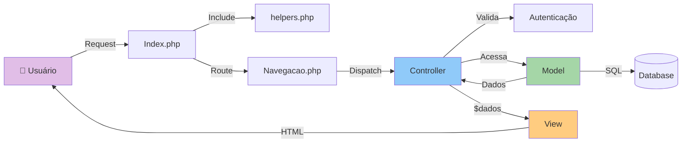
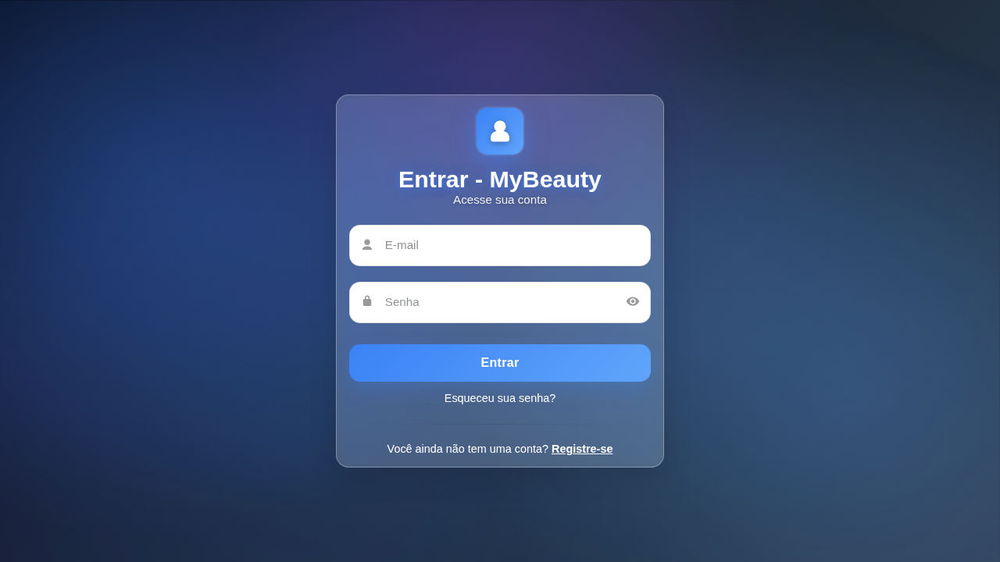
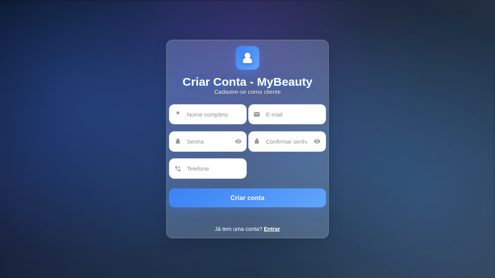

<div align="center">

# 💅 MyBeauty

### Sistema Completo de Gerenciamento para Salões de Beleza

[](https://php.net)
[](https://www.mysql.com/)
[](LICENSE)
[](https://en.wikipedia.org/wiki/Model%E2%80%93view%E2%80%93controller)

[Instalação](#-instalação) • [Funcionalidades](#-funcionalidades) • [Documentação](#-documentação) • [Screenshots](#-interface-e-screenshots) • [Tecnologias](#-tecnologias)

---

</div>

## 📖 Sobre o Projeto

**MyBeauty** é uma aplicação web moderna e intuitiva desenvolvida em PHP seguindo o padrão arquitetural **MVC (Model-View-Controller)**. Criado como projeto de TCC, oferece uma solução completa e profissional para administração de salões de beleza.

### 🎯 Objetivos do Sistema

- **Gestão Eficiente**: Centralizar operações de agendamento, clientes e serviços
- **Experiência do Usuário**: Interface moderna com design Glassmorphism
- **Segurança**: Implementação de boas práticas de autenticação e proteção de dados
- **Escalabilidade**: Arquitetura MVC facilitando manutenção e evolução

<div align="center">

### 📸 [Veja as Screenshots do Sistema →](screenshots/)

</div>

---

## 📑 Índice

- [Sobre o Projeto](#-sobre-o-projeto)
- [Funcionalidades](#-funcionalidades)
- [Tecnologias](#-tecnologias)
- [Instalação](#-instalação)
- [Estrutura do Projeto](#-estrutura-do-projeto)
- [Interface e Screenshots](#-interface-e-screenshots)
- [Banco de Dados](#-banco-de-dados)
- [Rotas e Navegação](#-rotas-e-navegação)
- [Segurança](#-segurança)
- [Documentação](#-documentação)
- [Desenvolvimento Futuro](#-desenvolvimento-futuro)
- [Contribuindo](#-contribuindo)
- [Autor](#-autor)

---

## ✨ Funcionalidades

<table>
<tr>
<td width="50%" valign="top">

### 🔐 Autenticação e Segurança

- ✅ Login seguro com bcrypt
- ✅ Cadastro de clientes
- ✅ Perfis diferenciados (Cliente/Funcionário)
- ✅ Recuperação de senha por email
- ✅ Toggle de visualização de senha
- ✅ Proteção contra SQL Injection
- ✅ Sessões seguras

</td>
<td width="50%" valign="top">

### 👥 Gestão de Pessoas

- 👤 Cadastro completo de clientes
- 💼 Gerenciamento de profissionais
- 📊 Dashboards personalizados
- 👔 Múltiplos tipos de funcionário
  - Recepcionista
  - Profissional de Beleza
  - Proprietário
  - Gerente Financeiro

</td>
</tr>
<tr>
<td width="50%" valign="top">

### 📅 Sistema de Agendamentos

- 📝 Criação de agendamentos
- ✏️ Edição de agendamentos
- ✅ Confirmação por profissional
- ❌ Cancelamento com justificativa
- 🔄 Status rastreável
  - `AGENDADO` - Pendente
  - `CONCLUIDO` - Finalizado
  - `CANCELADO` - Cancelado
- 📊 Visualização de agenda
- 🔔 Próximos agendamentos em destaque

</td>
<td width="50%" valign="top">

### 💅 Gestão de Serviços

- 📋 Cadastro de serviços
- 💰 Definição de preços
- ⏱️ Controle de duração
- ✏️ Edição de serviços
- 🔗 Associação com profissionais
- 📊 Listagem organizada

</td>
</tr>
</table>

---

## 🛠️ Tecnologias

<div align="center">

### Stack Principal

| Categoria | Tecnologia | Versão | Descrição |
|-----------|-----------|--------|-----------|
| **Backend** |  | 8.0+ | Linguagem principal do servidor |
| **Frontend** |    | ES6+ | Interface moderna e responsiva |
| **Banco de Dados** |  | 5.7+ | Armazenamento de dados |
| **Arquitetura** |  | - | Model-View-Controller |

### Design e UX

- **🎨 Design Pattern**: Glassmorphism
- **📱 Responsividade**: Desktop e Mobile
- **🎭 Animações**: CSS Transitions suaves
- **🌈 Paleta de Cores**: Rosa (#ea638c) com gradientes
- **✍️ Tipografia**: [Poppins](https://fonts.google.com/specimen/Poppins) (Google Fonts)
- **🎯 Icons**: Lucide Icons

### Ferramentas de Desenvolvimento

- **🔧 Servidor Local**: USBWebServer (Apache + MySQL)
- **🗄️ PDO**: Conexão segura com banco de dados
- **🔐 Bcrypt**: Hash de senhas
- **📝 Git**: Controle de versão

</div>

---

## 📁 Estrutura do Projeto

```
MyBeauty/
│
├── 📂 Controllers/              # 🎮 Lógica de Controle e Fluxo
│   ├── Navegacao.php           # Router principal (Front Controller)
│   ├── UsuarioController.php   # Autenticação e gestão de usuários
│   ├── AgendamentoController.php # Lógica de agendamentos
│   └── ServicoController.php   # Gestão de serviços
│
├── 📂 Models/                   # 💾 Camada de Dados e Negócio
│   ├── ConexaoDB.php           # Conexão PDO com banco (padrão Singleton)
│   ├── Usuario.php             # Modelo base de usuários
│   ├── Cliente.php             # Modelo específico de clientes
│   ├── Funcionario.php         # Modelo de funcionários
│   ├── Agendamento.php         # Modelo de agendamentos
│   └── Servico.php             # Modelo de serviços
│
├── 📂 Views/                    # 🎨 Camada de Apresentação
│   ├── login.php               # Tela de autenticação
│   ├── cadastrar.php           # Registro de novos clientes
│   ├── recuperar_senha.php     # Solicitação de reset
│   ├── resetar_senha.php       # Redefinição de senha
│   ├── inicio_cliente.php      # Dashboard do cliente
│   ├── inicio_profissional.php # Dashboard do profissional
│   ├── inicio_admin.php        # Dashboard administrativo
│   ├── agendamento.php         # Formulário de agendamento
│   ├── agenda_profissional.php # Visualização de agenda
│   ├── perfil.php              # Edição de perfil
│   └── gerenciar_servicos.php  # CRUD de serviços
│
├── 📂 assets/                   # 🎭 Recursos Estáticos
│   ├── css/
│   │   └── style.css           # Estilos globais (Glassmorphism)
│   ├── js/
│   │   └── script.js           # JavaScript (validações, interações)
│   └── images/
│       └── background.png      # Imagem de fundo
│
├── 📂 sql/                      # 🗄️ Scripts de Banco de Dados
│   ├── criar_banco.sql         # Script completo de criação
│   └── dados_exemplo.sql       # Dados iniciais para testes
│
├── 📂 screenshots/              # 📸 Capturas de Tela
│   ├── Auth/                   # Telas de autenticação
│   ├── Cliente/                # Telas do cliente
│   ├── Profissional/           # Telas do profissional
│   └── Admin/                  # Telas administrativas
│
├── 📄 Index.php                 # 🚪 Front Controller (Entry Point)
├── 📄 helpers.php               # 🔧 Funções Auxiliares
├── 📄 .env.example              # 🔐 Template de configuração
├── 📄 .gitignore                # 🚫 Arquivos ignorados pelo Git
│
├── 🚀 iniciar_servidor.bat      # Script de inicialização (Windows)
├── 🗄️ criar_banco.bat           # Script de setup do banco (Windows)
│
└── 📚 Documentação/
    ├── README.md               # Este arquivo
    ├── QUICK_START.md          # Guia rápido de refatoração MVC
    ├── GUIA_DE_TESTES.md       # Checklist completo de testes
    ├── GUIA_BANCO_DADOS.md     # Instruções detalhadas do banco
    └── INDEX_DOCUMENTACAO.md   # Índice de toda documentação
```

### 🎯 Padrão de Arquitetura MVC



### 🔄 Fluxo de Dados

1. **Usuário** faz requisição → `Index.php`
2. **Index.php** carrega `helpers.php` e chama `Navegacao.php`
3. **Navegacao.php** roteia para o **Controller** apropriado
4. **Controller**:
   - Valida autenticação
   - Acessa **Model** para buscar/salvar dados
   - Processa lógica de negócio
   - Prepara array `$dados`
   - Inclui **View**
5. **View** recebe `$dados` e renderiza HTML
6. HTML é retornado ao **Usuário**

---

## 🗄️ Banco de Dados

### 📊 Diagrama de Entidades

```
┌─────────────────┐         ┌──────────────────┐
│    Usuario      │         │   Funcionario    │
├─────────────────┤         ├──────────────────┤
│ id (PK)         │◄────────│ usuario_id (FK)  │
│ email           │         │ matricula        │
│ senha_hash      │         │ cargo            │
│ tipo            │         │ especialidade    │
│ data_criacao    │         └──────────────────┘
└────────┬────────┘                   │
         │                            │
         │                   ┌────────▼────────┐
         │                   │  Agendamento    │
┌────────▼────────┐          ├─────────────────┤
│    Cliente      │          │ id (PK)         │
├─────────────────┤          │ cliente_id (FK) │───┐
│ usuario_id (FK) │◄─────────│ profissional_id │   │
│ nome            │          │ data_hora       │   │
│ telefone        │          │ status          │   │
│ cpf             │          │ valor_total     │   │
└─────────────────┘          └─────────┬───────┘   │
                                       │           │
                            ┌──────────▼───────┐   │
                            │ Agendamento_     │   │
                            │    Servicos      │   │
                            ├──────────────────┤   │
                            │ agendamento_id   │───┘
                            │ servico_id (FK)  │───┐
                            └──────────────────┘   │
                                                   │
                            ┌──────────────────┐   │
                            │    Servico       │◄──┘
                            ├──────────────────┤
                            │ id (PK)          │
                            │ nome             │
                            │ descricao        │
                            │ preco            │
                            │ duracao_minutos  │
                            └──────────────────┘
```

### 📋 Tabelas Principais

<table>
<tr>
<th>Tabela</th>
<th>Descrição</th>
<th>Campos Principais</th>
</tr>

<tr>
<td><b>Usuario</b></td>
<td>Tabela base para autenticação</td>
<td>
• <code>id</code> - Chave primária<br>
• <code>email</code> - Login único<br>
• <code>senha_hash</code> - Bcrypt<br>
• <code>tipo</code> - CLIENTE ou FUNCIONARIO
</td>
</tr>

<tr>
<td><b>Cliente</b></td>
<td>Informações de clientes</td>
<td>
• <code>usuario_id</code> - FK para Usuario<br>
• <code>nome</code> - Nome completo<br>
• <code>telefone</code> - Contato<br>
• <code>cpf</code> - Documento
</td>
</tr>

<tr>
<td><b>Funcionario</b></td>
<td>Dados dos funcionários</td>
<td>
• <code>usuario_id</code> - FK para Usuario<br>
• <code>matricula</code> - Identificação<br>
• <code>cargo</code> - Função no salão<br>
• <code>especialidade</code> - Área de atuação
</td>
</tr>

<tr>
<td><b>Servico</b></td>
<td>Serviços oferecidos</td>
<td>
• <code>id</code> - Chave primária<br>
• <code>nome</code> - Nome do serviço<br>
• <code>preco</code> - Valor (DECIMAL)<br>
• <code>duracao_minutos</code> - Tempo estimado
</td>
</tr>

<tr>
<td><b>Agendamento</b></td>
<td>Compromissos marcados</td>
<td>
• <code>id</code> - Chave primária<br>
• <code>cliente_id</code> - FK para Cliente<br>
• <code>profissional_id</code> - FK para Funcionario<br>
• <code>data_hora</code> - DATETIME do agendamento<br>
• <code>status</code> - ENUM(AGENDADO, CONCLUIDO, CANCELADO)
</td>
</tr>

<tr>
<td><b>Agendamento_Servicos</b></td>
<td>Relação N:N (muitos para muitos)</td>
<td>
• <code>agendamento_id</code> - FK<br>
• <code>servico_id</code> - FK<br>
• Permite múltiplos serviços por agendamento
</td>
</tr>

<tr>
<td><b>RecuperacaoSenha</b></td>
<td>Tokens para reset de senha</td>
<td>
• <code>usuario_id</code> - FK para Usuario<br>
• <code>token</code> - Hash único<br>
• <code>data_expiracao</code> - Validade (24h)<br>
• <code>utilizado</code> - Boolean flag
</td>
</tr>
</table>

### 🔄 Status de Agendamento

| Status | Descrição | Badge |
|--------|-----------|-------|
| `AGENDADO` | Pendente de confirmação/atendimento | 🟡 Amarelo |
| `CONCLUIDO` | Serviço realizado | 🟢 Verde |
| `CANCELADO` | Cancelado pelo cliente/profissional | 🔴 Vermelho |

### 🛠️ Configuração

**Criar banco de dados**:

```sql
CREATE DATABASE tcc CHARACTER SET utf8mb4 COLLATE utf8mb4_unicode_ci;
```

**Importar estrutura**:

```bash
# Via script (Windows)
criar_banco.bat

# Via linha de comando
mysql -u root -p tcc < sql/criar_banco.sql
```

> 📘 **Documentação Completa**: [GUIA_BANCO_DADOS.md](GUIA_BANCO_DADOS.md) e [INSTRUCOES_CRIAR_BANCO.md](INSTRUCOES_CRIAR_BANCO.md)

---

## 🚀 Instalação

### ⚡ Quick Start (Recomendado)

Para usuários do **USBWebServer** (Windows):

```bash
# 1. Clone o repositório
git clone https://github.com/Nandiixx/My-beauty.git
cd My-beauty

# 2. Inicie o servidor (duplo clique)
iniciar_servidor.bat

# 3. Configure o banco de dados (duplo clique)
criar_banco.bat

# 4. Acesse o sistema
http://localhost:8000/Index.php
```

### 📋 Pré-requisitos

<table>
<tr>
<td width="50%">

**Mínimos**
- PHP 8.0 ou superior
- MySQL 5.7 ou superior
- Apache ou Nginx
- 512MB RAM
- 100MB espaço em disco

</td>
<td width="50%">

**Recomendados**
- PHP 8.2+
- MySQL 8.0+
- Apache 2.4+
- 1GB RAM
- 500MB espaço em disco

</td>
</tr>
</table>

### 🔧 Instalação Manual Detalhada

#### 1️⃣ Clone o Repositório

```bash
git clone https://github.com/Nandiixx/My-beauty.git
cd My-beauty
```

#### 2️⃣ Configure o Banco de Dados

**Opção A: Usando script automatizado (Windows)**

```bash
criar_banco.bat
```

**Opção B: Manual (XAMPP/phpMyAdmin)**

1. Acesse: `http://localhost/phpmyadmin`
2. Crie banco de dados: `tcc`
3. Importe: `sql/criar_banco.sql`

**Opção C: Linha de comando MySQL**

```bash
mysql -u root -p
CREATE DATABASE tcc CHARACTER SET utf8mb4 COLLATE utf8mb4_unicode_ci;
USE tcc;
SOURCE sql/criar_banco.sql;
EXIT;
```

> 📘 **Guia Detalhado**: Consulte [GUIA_BANCO_DADOS.md](GUIA_BANCO_DADOS.md) para instruções completas

#### 3️⃣ Configure Conexão com Banco

Edite o arquivo `.env` (copie de `.env.example`):

```env
DB_HOST=localhost
DB_PORT=3306
DB_NAME=tcc
DB_USER=root
DB_PASS=sua_senha_aqui
```

> ⚠️ **Segurança**: Nunca commite o arquivo `.env` com credenciais reais

#### 4️⃣ Inicie o Servidor

**Opção A: USBWebServer (Windows)**

```bash
iniciar_servidor.bat
```

**Opção B: PHP Built-in Server**

```bash
php -S localhost:8000
```

**Opção C: Apache/Nginx**

Configure virtual host apontando para o diretório do projeto.

#### 5️⃣ Acesse o Sistema

```
🌐 http://localhost:8000/Index.php
```

### ✅ Verificação da Instalação

Após instalação, verifique:

- [ ] ✅ Página de login carrega sem erros
- [ ] ✅ CSS está aplicado corretamente (design rosa/glassmorphism)
- [ ] ✅ JavaScript funciona (toggle de senha, validações)
- [ ] ✅ Formulários estão funcionais
- [ ] ✅ Console do navegador (F12) sem erros

### 🆘 Troubleshooting

<details>
<summary><b>❌ Erro: "Connection refused" ao acessar banco</b></summary>

**Solução**:
1. Verifique se MySQL está rodando: `mysql -u root -p`
2. Confirme credenciais no arquivo `.env`
3. Teste conexão: `php -r "new PDO('mysql:host=localhost', 'root', 'senha');"`

</details>

<details>
<summary><b>❌ Página em branco / Erro 500</b></summary>

**Solução**:
1. Ative display de erros:
```php
// No Index.php (temporário)
ini_set('display_errors', 1);
error_reporting(E_ALL);
```
2. Verifique logs do Apache/PHP
3. Confirme permissões de arquivo (755 para diretórios, 644 para arquivos)

</details>

<details>
<summary><b>❌ CSS/JS não carregam</b></summary>

**Solução**:
1. Verifique estrutura de pastas: `/assets/css/` e `/assets/js/`
2. Confirme caminhos nas Views: `../../assets/css/style.css`
3. Teste acesso direto: `http://localhost:8000/assets/css/style.css`
4. Verifique permissões de leitura nos arquivos

</details>

> 📚 **Mais Ajuda**: Consulte [GUIA_DE_TESTES.md](GUIA_DE_TESTES.md) para checklist completo

---

## 🎨 Interface e Screenshots

O MyBeauty apresenta um design moderno e intuitivo, focado na experiência do usuário:

### 🎭 Design System

<table>
<tr>
<td width="33%">

**🌈 Paleta de Cores**
- Primary: `#ea638c` (Rosa)
- Background: `#1e293b` (Azul escuro)
- Cards: Glassmorphism
- Text: `#ffffff` / `#e2e8f0`

</td>
<td width="33%">

**✍️ Tipografia**
- Font: Poppins
- Weights: 300, 400, 600
- Line-height: 1.6
- Hierarquia clara

</td>
<td width="33%">

**📱 Responsividade**
- Desktop: 1280px+
- Tablet: 768px - 1279px
- Mobile: < 768px
- Grid flexível

</td>
</tr>
</table>

### 📸 Capturas de Tela

Confira todas as interfaces do sistema organizadas por tipo de usuário:

#### 🔐 Autenticação (4 telas)

<table>
<tr>
<td width="50%">

**Login**
<br>

<br>
<sub>Interface de autenticação com toggle de senha</sub>

</td>
<td width="50%">

**Cadastro**
<br>

<br>
<sub>Registro de novos clientes com validação</sub>

</td>
</tr>
</table>

#### 👤 Cliente (4 telas)

- **Dashboard**: Visão geral de agendamentos e estatísticas
- **Criar Agendamento**: Formulário intuitivo com seleção de profissional e serviço
- **Meu Perfil**: Edição de dados pessoais
- **Editar Agendamento**: Modificação de agendamentos existentes

#### 💼 Profissional (4 telas)

- **Dashboard**: Estatísticas de atendimentos e próximos compromissos
- **Minha Agenda**: Visualização completa da agenda
- **Gerenciar**: Confirmação e cancelamento de agendamentos
- **Cadastrar**: Formulário de inclusão de novos profissionais

#### ⚙️ Administrador (5 telas)

- **Dashboard**: Métricas gerais do salão
- **Serviços**: CRUD completo de serviços oferecidos
- **Funcionários**: Gestão da equipe
- **Agendamentos**: Visão administrativa completa
- **Formulário Serviço**: Cadastro detalhado de serviços

> 📁 **Todas as screenshots**: Navegue pela pasta [screenshots/](screenshots/) para ver todas as 17 capturas em alta resolução (1280x720)

### ♿ Acessibilidade (a11y)

O sistema implementa boas práticas de acessibilidade:

- ✅ **Contraste de Cores**: WCAG AA compliant
- ✅ **Navegação por Teclado**: Todos os elementos interativos acessíveis
- ✅ **Labels Semânticas**: Formulários com labels explícitas
- ✅ **ARIA Attributes**: Roles e states onde apropriado
- ✅ **Foco Visível**: Indicadores claros de foco
- ✅ **Erros Descritivos**: Mensagens de validação claras e contextuais

### 🎯 Princípios de UX Aplicados

1. **Hierarquia Visual**: Uso estratégico de tamanhos, cores e espaçamento
2. **Feedback Imediato**: Validações em tempo real e confirmações visuais
3. **Consistência**: Padrões repetidos em todas as interfaces
4. **Prevenção de Erros**: Validações client-side antes do submit
5. **Clareza**: Textos diretos e calls-to-action evidentes
6. **Eficiência**: Redução de cliques necessários para tarefas comuns

---

## 🔐 Segurança

O MyBeauty implementa múltiplas camadas de segurança para proteger dados sensíveis:

### 🛡️ Práticas de Segurança Implementadas

<table>
<tr>
<td width="50%" valign="top">

#### ✅ **Autenticação**

- **Bcrypt Hashing**: Senhas nunca armazenadas em texto plano
  ```php
  password_hash($senha, PASSWORD_BCRYPT)
  ```
- **Salt Automático**: Bcrypt gera salt único por senha
- **Verificação Segura**: `password_verify()` com timing-safe comparison
- **Sessões PHP**: Gerenciamento nativo com cookies HttpOnly

#### ✅ **Proteção contra SQL Injection**

- **PDO Prepared Statements**: Todas as queries parametrizadas
  ```php
  $stmt = $pdo->prepare("SELECT * FROM Usuario WHERE email = :email");
  $stmt->execute([':email' => $email]);
  ```
- **Named Parameters**: Sem concatenação de strings em SQL
- **Type Binding**: Validação de tipos de dados

</td>
<td width="50%" valign="top">

#### ✅ **Proteção XSS (Cross-Site Scripting)**

- **Escape de Output**: Helper `e()` usa `htmlspecialchars()`
  ```php
  echo e($usuario_nome); // Safe output
  ```
- **ENT_QUOTES**: Protege aspas simples e duplas
- **UTF-8 Encoding**: Previne bypasses de charset

#### ✅ **Validação de Dados**

- **Server-side Validation**: Nunca confiar apenas em client-side
- **Whitelist Approach**: Validar o que é permitido, não proibir
- **Type Checking**: Validação de tipos de dados esperados
- **Sanitização**: Limpeza de inputs antes do processamento

</td>
</tr>
</table>

### 🔒 Controle de Acesso

```php
// Três níveis de verificação

// 1. Autenticação básica
if (!isset($_SESSION['usuario_id'])) {
    // Redireciona para login
}

// 2. Verificação de tipo de usuário
if ($_SESSION['usuario_tipo'] !== 'CLIENTE') {
    // Acesso negado
}

// 3. Verificação de cargo específico (para funcionários)
if (!in_array($_SESSION['usuario_cargo'], ['PROPRIETARIO', 'GERENTE'])) {
    // Acesso restrito
}
```

### ⚠️ Áreas para Melhorias Futuras

<details>
<summary><b>📌 Roadmap de Segurança</b></summary>

#### Implementações Planejadas

- [ ] **CSRF Protection**
  - Tokens únicos por formulário
  - Validação no servidor
  
- [ ] **Rate Limiting**
  - Proteção contra brute force
  - Limite de tentativas de login
  
- [ ] **HTTPS Enforcement**
  - Redirecionamento automático
  - Strict-Transport-Security header
  
- [ ] **Content Security Policy (CSP)**
  - Restrição de scripts inline
  - Whitelist de fontes confiáveis
  
- [ ] **Two-Factor Authentication (2FA)**
  - TOTP via Google Authenticator
  - SMS backup
  
- [ ] **Audit Logging**
  - Log de tentativas de acesso
  - Registro de alterações críticas
  
- [ ] **Password Policy**
  - Requisitos de complexidade
  - Expiração periódica
  - Histórico de senhas

</details>

### 🔑 Recuperação de Senha Segura

```
1. Usuário solicita reset → Token único gerado (SHA-256)
2. Token armazenado com expiração (24 horas)
3. Email enviado com link único
4. Validação: Token existe + Não expirou + Não utilizado
5. Nova senha definida → Token marcado como utilizado
6. Impossível reutilizar token
```

### 📋 Checklist de Segurança para Deploy

Antes de colocar em produção:

- [x] ✅ Senhas hasheadas com bcrypt
- [x] ✅ PDO prepared statements em todas queries
- [x] ✅ Escape de output com `htmlspecialchars()`
- [x] ✅ Validação de sessões
- [x] ✅ Controle de acesso por tipo/cargo
- [ ] ⚠️ HTTPS habilitado
- [ ] ⚠️ CSRF tokens implementados
- [ ] ⚠️ Rate limiting em login
- [ ] ⚠️ Headers de segurança configurados
- [ ] ⚠️ Logs de auditoria ativos
- [ ] ⚠️ Backup automático de banco
- [ ] ⚠️ Variáveis de ambiente (`.env`) fora do webroot

### 🚨 Reportar Vulnerabilidades

Se você encontrar uma vulnerabilidade de segurança:

1. **NÃO** abra uma issue pública
2. Envie um email privado para: [seu-email@exemplo.com]
3. Inclua: descrição detalhada, steps to reproduce, impacto
4. Aguarde resposta em até 48h

> 🏆 **Responsible Disclosure**: Valorizamos pesquisadores de segurança e responderemos prontamente a relatórios válidos.

---

## 🧭 Rotas e Navegação

O sistema utiliza o padrão **Front Controller** onde todas as requisições passam por `Index.php` e são roteadas via `Controllers/Navegacao.php`.

### 🔑 Padrão de URL

```
Index.php?acao=<nome_da_acao>
```

### 📍 Rotas Principais

<details open>
<summary><b>🔐 Autenticação</b></summary>

| Rota | Método | Descrição |
|------|--------|-----------|
| `login_mostrar` | GET | Exibe formulário de login |
| `autenticar` | POST | Processa credenciais |
| `cadastro_mostrar` | GET | Formulário de registro |
| `salvar_cliente` | POST | Cria nova conta de cliente |
| `logout` | GET | Encerra sessão |
| `recuperar_senha_mostrar` | GET | Formulário de recuperação |
| `recuperar_senha` | POST | Envia email com token |
| `resetar_senha_mostrar` | GET | Form com token validado |
| `resetar_senha` | POST | Atualiza nova senha |

**Exemplo**:
```php
// Login
Index.php?acao=login_mostrar

// Processar login
Index.php?acao=autenticar
// POST: email, senha
```

</details>

<details open>
<summary><b>📅 Agendamentos</b></summary>

| Rota | Método | Descrição |
|------|--------|-----------|
| `agendamento_mostrar` | GET | Formulário de novo agendamento |
| `agendamento_salvar` | POST | Cria agendamento |
| `agendamento_editar_form` | GET | Form de edição (param: `id`) |
| `agendamento_atualizar` | POST | Atualiza agendamento |
| `agenda_profissional_mostrar` | GET | Agenda do profissional logado |
| `confirmar_agendamento` | GET | Confirma agendamento (param: `id`) |
| `cancelar_agendamento` | POST | Cancela agendamento (param: `id`) |

**Exemplo**:
```php
// Criar agendamento
Index.php?acao=agendamento_mostrar

// Confirmar específico
Index.php?acao=confirmar_agendamento&id=123
```

</details>

<details>
<summary><b>👥 Dashboards</b></summary>

| Rota | Método | Descrição | Acesso |
|------|--------|-----------|--------|
| `inicio` | GET | Redireciona para dashboard apropriado | Todos |
| `dashboard_cliente` | GET | Dashboard do cliente | CLIENTE |
| `dashboard_profissional` | GET | Dashboard do profissional | FUNCIONARIO (Profissional) |
| `dashboard_admin` | GET | Dashboard administrativo | FUNCIONARIO (Admin/Proprietário) |

**Lógica de Redirecionamento**:
```php
// Baseado em $_SESSION['usuario_tipo'] e $_SESSION['usuario_cargo']
CLIENTE → dashboard_cliente
FUNCIONARIO (Profissional) → dashboard_profissional
FUNCIONARIO (Admin/Proprietário) → dashboard_admin
```

</details>

<details>
<summary><b>💅 Serviços (Admin)</b></summary>

| Rota | Método | Descrição | Acesso |
|------|--------|-----------|--------|
| `servicos_listar` | GET | Lista todos serviços | Admin |
| `servico_form` | GET | Form criar/editar (param: `id` opcional) | Admin |
| `servico_salvar` | POST | Cria novo serviço | Admin |
| `servico_atualizar` | POST | Atualiza serviço | Admin |
| `servico_deletar` | POST | Remove serviço | Admin |

</details>

<details>
<summary><b>👤 Perfil</b></summary>

| Rota | Método | Descrição |
|------|--------|-----------|
| `perfil_mostrar` | GET | Exibe dados do usuário |
| `perfil_atualizar` | POST | Atualiza informações |
| `perfil_senha` | POST | Altera senha |

</details>

### 🔒 Proteção de Rotas

Cada Controller valida autenticação antes de processar:

```php
// Exemplo de validação em Controller
public function metodo() {
    // Verifica se está logado
    if (!isset($_SESSION['usuario_id'])) {
        header('Location: Index.php?acao=login_mostrar');
        exit;
    }
    
    // Verifica tipo de usuário
    if ($_SESSION['usuario_tipo'] !== 'CLIENTE') {
        header('Location: Index.php?acao=acesso_negado');
        exit;
    }
    
    // Lógica do método...
}
```

### 🎯 Helpers para Navegação

Funções utilitárias em `helpers.php`:

```php
// Verifica se usuário está autenticado
estaAutenticado(): bool

// Verifica tipo de usuário
verificarTipoUsuario(string $tipo): bool

// Verifica cargo do funcionário
verificarCargo(array $cargos): bool

// Exemplo de uso
if (!estaAutenticado()) {
    header('Location: Index.php?acao=login_mostrar');
    exit;
}
```

### 📊 Fluxo de Requisição

```
1. Usuário → Index.php?acao=agendamento_salvar
            ↓
2. Index.php → carrega helpers.php, inicia sessão
            ↓
3. Index.php → include Controllers/Navegacao.php
            ↓
4. Navegacao.php → switch($_GET['acao'])
            ↓
5. Navegacao.php → new AgendamentoController()
            ↓
6. Controller → valida autenticação
            ↓
7. Controller → acessa Model, processa dados
            ↓
8. Controller → prepara $dados, inclui View
            ↓
9. View → renderiza HTML com $dados
            ↓
10. HTML → retorna ao Usuário
```

---

## 📚 Documentação

O projeto conta com documentação completa e bem organizada:

### 📖 Documentos Principais

<table>
<tr>
<th width="30%">Documento</th>
<th width="50%">Descrição</th>
<th width="20%">Público</th>
</tr>

<tr>
<td>
<a href="README.md"><b>README.md</b></a>
<br><sub>⏱️ 15 min</sub>
</td>

<sub>Guia de navegação e fluxos de leitura recomendados</sub>
</td>
<td>
<b>Todos</b>
</td>

<td>
<b>QA/Devs</b>
</td>
</tr>

<tr>
<td>
<a href="GUIA_BANCO_DADOS.md"><b>GUIA_BANCO_DADOS.md</b></a>
<br><sub>⏱️ 10 min</sub>
</td>
<td>
Instruções detalhadas de configuração do MySQL
<br>
<sub>Setup XAMPP, criação de banco, import de SQL</sub>
</td>
<td>
<b>Devs/Ops</b>
</td>
</tr>

<tr>
<td>
<a href="INSTRUCOES_CRIAR_BANCO.md"><b>INSTRUCOES_CRIAR_BANCO.md</b></a>
<br><sub>⏱️ 5 min</sub>
</td>
<td>
Passo a passo ilustrado para criar banco
<br>
<sub>Tutorial visual para iniciantes</sub>
</td>
<td>
<b>Iniciantes</b>
</td>
</tr>

<tr>
<td>
<a href="screenshots/README.md"><b>screenshots/README.md</b></a>
<br><sub>⏱️ 5 min</sub>
</td>
<td>
Documentação de todas as capturas de tela
<br>
<sub>Organização, especificações técnicas, índice visual</sub>
</td>
<td>
<b>UI/UX</b>
</td>
</tr>
</table>

### 🗺️ Fluxos de Leitura Recomendados

<details>
<summary><b>👨‍💻 Novo Desenvolvedor no Projeto</b></summary>

```
1. README.md (este arquivo)        → Visão geral completa
2. QUICK_START.md                  → Entender refatoração MVC
3. GUIA_BANCO_DADOS.md             → Configurar ambiente
4. INDEX_DOCUMENTACAO.md           → Navegar documentação técnica
5. GUIA_DE_TESTES.md               → Executar testes
```

</details>

<details>
<summary><b>🧪 Testador (QA)</b></summary>

```
1. README.md (seções principais)   → Entender funcionalidades
2. GUIA_DE_TESTES.md              → Checklist completo
3. screenshots/README.md           → Referência visual
```

</details>

<details>
<summary><b>🎨 Designer UI/UX</b></summary>

```
1. screenshots/README.md           → Todas as interfaces
2. README.md (seção Interface)     → Design system e a11y
3. assets/css/style.css            → Estilos e variáveis
```

</details>

<details>
<summary><b>👔 Gerente/Líder Técnico</b></summary>

```
1. README.md (Sobre + Funcionalidades) → Visão de produto
2. README.md (Segurança)               → Status de segurança
3. INDEX_DOCUMENTACAO.md                → Documentação disponível
```

</details>

### 📝 Convenções de Código

Para manter consistência no projeto:

```php
// ✅ BOM: Nomenclatura clara e consistente
class AgendamentoController {
    public function mostrarDashboardCliente() {
        // Lógica aqui
    }
}

// ✅ BOM: Comentários explicativos onde necessário
// Valida se o usuário tem permissão de acesso
if (!verificarCargo(['PROPRIETARIO', 'GERENTE'])) {
    header('Location: Index.php?acao=acesso_negado');
    exit;
}

// ✅ BOM: Use helpers para operações comuns
$data_formatada = formatarData($agendamento->getDataHora());
$badge = statusBadge($agendamento->getStatus());
```

### 🏗️ Padrões Arquiteturais

- **MVC**: Separação clara de responsabilidades
- **Front Controller**: Ponto único de entrada (`Index.php`)
- **Singleton**: Conexão com banco de dados (`ConexaoDB`)
- **Repository Pattern**: Models abstraem acesso a dados

### 🔗 Links Úteis

- **Padrão MVC**: [https://pt.wikipedia.org/wiki/MVC](https://pt.wikipedia.org/wiki/MVC)
- **PHP PDO**: [https://www.php.net/manual/pt_BR/book.pdo.php](https://www.php.net/manual/pt_BR/book.pdo.php)
- **WCAG (Acessibilidade)**: [https://www.w3.org/WAI/WCAG21/quickref/](https://www.w3.org/WAI/WCAG21/quickref/)
- **PHP Security**: [https://owasp.org/www-project-php-security-cheat-sheet/](https://owasp.org/www-project-php-security-cheat-sheet/)

---

## 🚀 Desenvolvimento Futuro

### 🎯 Roadmap de Funcionalidades

<table>
<tr>
<th>Prioridade</th>
<th>Funcionalidade</th>
<th>Status</th>
<th>Estimativa</th>
</tr>

<tr>
<td>🔴 <b>Alta</b></td>
<td>
<b>CRUD Completo de Serviços</b>
<br>
<sub>Interface administrativa completa para gerenciamento</sub>
</td>
<td>
🟡 Em Progresso
</td>
<td>
1 sprint
</td>
</tr>

<tr>
<td>🔴 <b>Alta</b></td>
<td>
<b>Sistema de Notificações</b>
<br>
<sub>Email e push para lembretes de agendamento</sub>
</td>
<td>
⚪ Planejado
</td>
<td>
2 sprints
</td>
</tr>

<tr>
<td>🟠 <b>Média</b></td>
<td>
<b>Relatórios e Estatísticas</b>
<br>
<sub>Dashboards avançados com gráficos e métricas</sub>
</td>
<td>
⚪ Planejado
</td>
<td>
2 sprints
</td>
</tr>

<tr>
<td>🟠 <b>Média</b></td>
<td>
<b>Sistema Financeiro</b>
<br>
<sub>Controle de receitas, despesas e comissões</sub>
</td>
<td>
⚪ Planejado
</td>
<td>
3 sprints
</td>
</tr>

<tr>
<td>🟠 <b>Média</b></td>
<td>
<b>Integração com Pagamentos</b>
<br>
<sub>Gateway de pagamento (Mercado Pago, PagSeguro)</sub>
</td>
<td>
⚪ Planejado
</td>
<td>
2 sprints
</td>
</tr>

<tr>
<td>🟢 <b>Baixa</b></td>
<td>
<b>API REST</b>
<br>
<sub>Endpoints para integração externa e app mobile</sub>
</td>
<td>
⚪ Backlog
</td>
<td>
3 sprints
</td>
</tr>

<tr>
<td>🟢 <b>Baixa</b></td>
<td>
<b>Aplicativo Mobile</b>
<br>
<sub>App nativo ou React Native para iOS/Android</sub>
</td>
<td>
⚪ Backlog
</td>
<td>
4-6 sprints
</td>
</tr>

<tr>
<td>🟢 <b>Baixa</b></td>
<td>
<b>Sistema de Fidelidade</b>
<br>
<sub>Programa de pontos e recompensas para clientes</sub>
</td>
<td>
⚪ Backlog
</td>
<td>
2 sprints
</td>
</tr>
</table>

### 🔧 Melhorias Técnicas Planejadas

- [ ] **Testes Automatizados**
  - PHPUnit para testes unitários
  - Selenium para testes E2E
  - Cobertura de código > 80%

- [ ] **CI/CD Pipeline**
  - GitHub Actions para deploy automático
  - Ambientes staging e produção
  - Rollback automatizado

- [ ] **Performance**
  - Cache com Redis
  - CDN para assets estáticos
  - Otimização de queries (indexação)

- [ ] **Documentação API**
  - Swagger/OpenAPI specs
  - Postman collections
  - Exemplos de integração

- [ ] **Monitoring e Logging**
  - Sentry para error tracking
  - New Relic para performance
  - ELK stack para logs centralizados

### 💡 Ideias para Explorar

<details>
<summary><b>Funcionalidades Experimentais</b></summary>

- 🤖 **Chatbot de Atendimento**: WhatsApp bot para agendamentos
- 📸 **Galeria de Trabalhos**: Portfolio de serviços realizados
- ⭐ **Sistema de Avaliações**: Clientes avaliarem profissionais
- 📅 **Agendamento Recorrente**: Marcar serviços periódicos
- 🎁 **Cupons de Desconto**: Sistema de promoções e vouchers
- 📊 **Analytics Avançado**: Insights de negócio com BI
- 🌐 **Multi-tenancy**: Suporte para múltiplos salões
- 🔔 **SMS Notifications**: Lembretes via SMS
- 📱 **Progressive Web App (PWA)**: App web instalável
- 🗣️ **Acessibilidade Avançada**: Screen reader otimizado

</details>

### 🤝 Como Contribuir com o Roadmap

Tem uma ideia? Siga estes passos:

1. Verifique se já não existe uma issue similar
2. Abra uma **Feature Request** no GitHub
3. Descreva: problema, solução proposta, benefícios
4. Participe da discussão
5. Se aprovado, implemente e envie PR

---

## 🤝 Contribuindo

Contribuições são sempre bem-vindas! Veja como você pode ajudar:

### 🌟 Formas de Contribuir

- 🐛 **Reportar Bugs**: Abra uma issue detalhando o problema
- 💡 **Sugerir Funcionalidades**: Compartilhe suas ideias
- 📝 **Melhorar Documentação**: Corrija typos, adicione exemplos
- 💻 **Código**: Implemente features ou corrija bugs
- 🎨 **Design**: Melhore UI/UX, crie assets
- 🧪 **Testes**: Adicione testes automatizados

### 📝 Processo de Contribuição

```bash
# 1. Fork o repositório
git clone https://github.com/seu-usuario/My-beauty.git

# 2. Crie uma branch para sua feature
git checkout -b feature/minha-nova-feature

# 3. Commit suas mudanças
git commit -m "feat: adiciona nova funcionalidade X"

# 4. Push para o GitHub
git push origin feature/minha-nova-feature

# 5. Abra um Pull Request
# Descreva suas mudanças, adicione screenshots se aplicável
```

### ✅ Checklist Antes do PR

- [ ] Código segue convenções do projeto
- [ ] Funciona localmente sem erros
- [ ] Não quebra funcionalidades existentes
- [ ] Documentação atualizada (se necessário)
- [ ] Testes adicionados (quando aplicável)
- [ ] Commit messages seguem padrão (conventional commits)

### 📏 Padrão de Commit

Use [Conventional Commits](https://www.conventionalcommits.org/):

```
feat: adiciona sistema de notificações por email
fix: corrige bug no cálculo de duração de serviços
docs: atualiza README com instruções de deploy
style: formata código seguindo PSR-12
refactor: reorganiza estrutura de Controllers
test: adiciona testes para AgendamentoController
chore: atualiza dependências do composer
```

### 👥 Código de Conduta

- Seja respeitoso e inclusivo
- Aceite críticas construtivas
- Foque no que é melhor para a comunidade
- Mostre empatia com outros colaboradores

---

## 👨‍💻 Autor

<div align="center">

### 👤 **Hernandes (Nandiixx)**

[](https://github.com/Nandiixx)
[](mailto:seu-email@exemplo.com)

**Estudante de Desenvolvimento de Sistemas**
<br>
<sub>Este projeto foi desenvolvido como Trabalho de Conclusão de Curso (TCC)</sub>

---

### 🎓 Sobre o Projeto Acadêmico

**Instituição**: Etec Martin Luther King
<br>
**Curso**: Técnico/Tecnólogo em Desenvolvimento de Sistemas
<br>
**Ano**: 2024/2025
<br>
**Orientador**: Tatiana Carla De Mattos Valerio Monteiro

</div>

---

## 📞 Suporte

### 💬 Precisa de Ajuda?

<table>
<tr>
<td width="50%">

**🐛 Bugs e Problemas Técnicos**

Encontrou um bug?
1. Verifique as [Issues abertas](https://github.com/Nandiixx/My-beauty/issues)
2. Se não existir, [abra uma nova issue](https://github.com/Nandiixx/My-beauty/issues/new)
3. Descreva: o que esperava, o que aconteceu, steps to reproduce

</td>
<td width="50%">

**💡 Dúvidas sobre Uso**

Tem dúvidas sobre como usar?
1. Consulte a [Documentação](#-documentação)
2. Verifique as [Issues fechadas](https://github.com/Nandiixx/My-beauty/issues?q=is%3Aissue+is%3Aclosed)
3. Abra uma [Discussion](https://github.com/Nandiixx/My-beauty/discussions)

</td>
</tr>
</table>

### 📧 Contato Direto

- **Email**: nandiixx.official@gmail.com
- **LinkedIn**: [Seu Perfil](https://linkedin.com/in/nandiixx)

---

## 📄 Licença

Este projeto foi desenvolvido para fins **acadêmicos** como Trabalho de Conclusão de Curso (TCC).

```
Copyright (c) 2024 Hernandes (Nandiixx)

Este projeto é de código aberto e está disponível para estudo e contribuições.
Sinta-se livre para usar como referência ou base para seus próprios projetos.
```

> ⚖️ **Nota**: Se você deseja usar este projeto comercialmente, por favor entre em contato.

---

## 🙏 Agradecimentos

Agradecimentos especiais a todos que contribuíram para este projeto:

- 🎓 **Professores e Orientadores** pela orientação acadêmica
- 👥 **Colegas de Curso** pelo feedback e sugestões
- 💻 **Comunidade Open Source** pelas bibliotecas e ferramentas
- ☕ **Café** por manter a produtividade alta

---

## ⭐ Mostre seu Apoio

Se este projeto foi útil para você, considere:

- ⭐ **Dar uma estrela** no GitHub
- 🔄 **Compartilhar** com outros desenvolvedores
- 🐛 **Reportar bugs** para melhorar o projeto
- 💻 **Contribuir** com código ou documentação

---

<div align="center">

**Desenvolvido com ❤️ e muito ☕ para o TCC**

[](https://php.net)
[](https://en.wikipedia.org/wiki/Model%E2%80%93view%E2%80%93controller)
[](https://www.buymeacoffee.com)

---

**MyBeauty** © 2024 - Sistema de Gerenciamento para Salões de Beleza

[⬆️ Voltar ao Topo](#-mybeauty)

</div>


